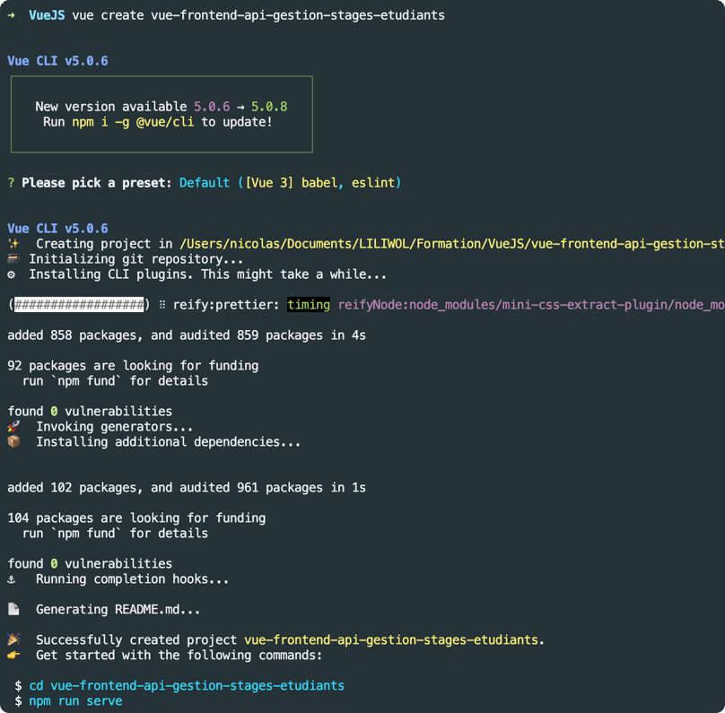
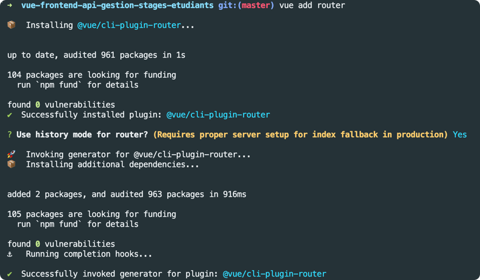

# vue-frontend-api-gestion-stages-etudiants

# Création de l'application

Les majuscules ne sont pas permises!

```bash
vue create vue-frontend-api-gestion-stage-etudiants
```



Déplacez-vous ensuite dans le dossier créé.

```bash
cd vue-frontend-api-gestion-stage-etudiants
```

# Ajout du router

```bash
vue add router
```



# Configuration de la clé API

Dans le fichier .env, remplissez une chaine de 42 caractères

```
VUE_APP_API_KEY=""
```

## Project setup
```
npm install
```

### Compiles and hot-reloads for development
```
npm run serve
```

### Compiles and minifies for production
```
npm run build
```

### Lints and fixes files
```
npm run lint
```

### Customize configuration
See [Configuration Reference](https://cli.vuejs.org/config/).
